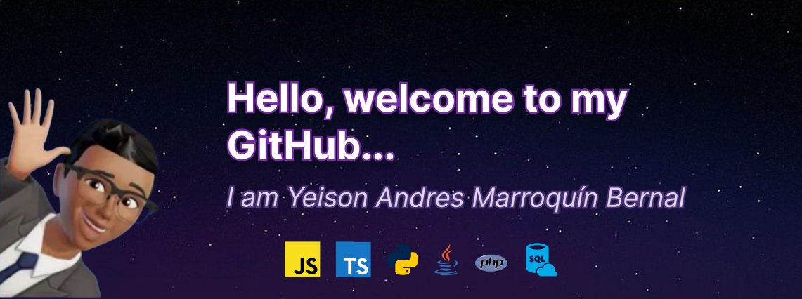

<body>
  <figure>
    
  </figure>
  

    <!-- INTRO -->
    <h1 style="text-align: center; color: #4CAF50;">
      👋 Know a little about me 👨‍💻
    </h1>
    

      <strong>Backend / Full-Stack Developer</strong> focused on building
      scalable APIs, web applications, and reliable software solutions.
      I enjoy solving real-world problems through clean code, modern
      technologies, and continuous learning. 🚀
    

    <!-- ABOUT -->
    <ul>
      <li>🌎 Based in Tolima, Colombia.</li>
      <li>💻 Backend-focused Full-Stack Developer.</li>
      <li>🚀 Experience building REST APIs and web applications.</li>
      <li>🧠 Interested in software architecture, automation, and AI.</li>
      <li>📚 Continuously learning new technologies and best practices.</li>
      <li>✨ Always looking for challenging projects and professional growth.</li>
    </ul>
    <!-- TECH STACK -->
    <h2 style="color: #4CAF50;">🛠️ Tech Stack</h2>
    <h3>💻 Languages</h3>
    

      
      
      
      
    

    <h3>🎨 Frontend</h3>
    

      
      
      
      
      
    

    <h3>⚙️ Backend</h3>
    

      
      
      
      
      
      
    

    <h3>🗄️ Databases</h3>
    

      
      
      
      
    

    <h3>🔧 Tools & Technologies</h3>
    

      
      
      
      
      
    

    <!-- FEATURED PROJECTS -->
    <h2 style="color: #4CAF50;">🚀 Featured Projects</h2>
    <!-- FEATURED PROJECTS -->

<h2 style="color: #4CAF50;">🚀 Featured Projects</h2>

<table style="width: 100%; border-collapse: collapse; text-align: left; font-size: 16px;">

  <thead>
    <tr style="background-color: #f2f2f2;">
      <th style="padding: 8px; border: 1px solid #ddd;">
        Project
      </th>
      <th style="padding: 8px; border: 1px solid #ddd;">
        Description
      </th>
      <th style="padding: 8px; border: 1px solid #ddd;">
        Technologies
      </th>
    </tr>
  </thead>

  <tbody>
    <!-- NUFFYS -->
    <tr>
      <td style="padding: 8px; border: 1px solid #ddd;">
        <strong>Nuffys</strong>
      </td>
      <td style="padding: 8px; border: 1px solid #ddd;">
        Comprehensive clinical and administrative management system
        developed as a RESTful API for specialized therapy clinics.
        It manages users, roles, patients, clinical records, appointments,
        invoicing, and partial payments, with JWT authentication and
        role-based access control.
      </td>
      <td style="padding: 8px; border: 1px solid #ddd;">
        Node.js, Express.js, MySQL, Sequelize, JWT, bcrypt.
      </td>
    </tr>
    <!-- UNIVERSITY -->
    <tr style="background-color: #f9f9f9;">
      <td style="padding: 8px; border: 1px solid #ddd;">
        <strong>UniverCity</strong>
      </td>
      <td style="padding: 8px; border: 1px solid #ddd;">
        University education platform designed to manage academic
        programs, semesters, grades, and users with different roles.
        Includes authentication, academic management, data validation,
        and structured database migrations.
      </td>
      <td style="padding: 8px; border: 1px solid #ddd;">
        Python, FastAPI, PostgreSQL, Alembic, JWT, Pydantic.
      </td>
    </tr>
    <!-- DOMINOS STORE -->
    <tr>
      <td style="padding: 8px; border: 1px solid #ddd;">
        <strong>Dominós Store</strong>
      </td>
      <td style="padding: 8px; border: 1px solid #ddd;">
        E-commerce backend currently under development, designed to
        manage users, roles, products, shopping carts, cart details,
        and product images. The API follows a modular structure with
        database migrations and authentication.
      </td>
      <td style="padding: 8px; border: 1px solid #ddd;">
        Node.js, Express.js, MySQL, Sequelize, JWT, bcrypt, Nodemon.
      </td>
    </tr>
    <!-- RICK AND MORTY -->
    <tr style="background-color: #f9f9f9;">
      <td style="padding: 8px; border: 1px solid #ddd;">
        <strong>Rick and Morty App</strong>
      </td>
      <td style="padding: 8px; border: 1px solid #ddd;">
        React application that consumes the public Rick and Morty API,
        allowing users to explore characters and their information
        through a dynamic and interactive interface.
      </td>
      <td style="padding: 8px; border: 1px solid #ddd;">
        JavaScript, React.js, REST API, CSS.
      </td>
    </tr>
  </tbody>
</table>
     <!-- BACKEND FOCUS -->
    <h2 style="color: #4CAF50;">⚙️ Backend Focus</h2>
    

      My main area of interest is backend development, where I enjoy
      designing APIs, working with databases, implementing authentication,
      integrating external services, and building maintainable software.
    

    <ul>
      <li>🔹 REST API development</li>
      <li>🔹 Authentication & authorization</li>
      <li>🔹 Relational & NoSQL databases</li>
      <li>🔹 API integrations</li>
      <li>🔹 Backend architecture</li>
      <li>🔹 Data validation</li>
      <li>🔹 Automation and AI integrations</li>
      <li>🔹 Software development with Node.js, TypeScript and Python</li>
    </ul>
    <!-- CURRENT INTERESTS -->
    <h2 style="color: #4CAF50;">🌱 Currently Interested In</h2>
    

      
      
      
      
      
      
      
      
    

    <!-- QUOTE -->
    <h2 style="color: #4CAF50;">🌟 Inspiring Quote</h2>
    <blockquote style="
      font-style: italic;
      border-left: 4px solid #4CAF50;
      padding-left: 16px;
      color: #555;
    ">
      "Code is like art: there is always something new to discover and learn.
      Never stop creating."
    </blockquote>

  

</body>