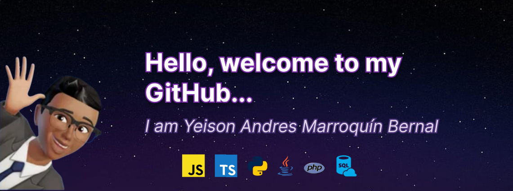

<body>
   <figure>
    
   </figure>
   

  <h1 style="text-align: center; color: #4CAF50;">👋Know a little about me👨‍💻</h1>
  

    I am a passionate Full-Stack Developer dedicated to creating modern and functional web applications. 
    Learning new technologies and solving challenging problems through code is my superpower. 🚀
  

  
  <h2 style="color: #4CAF50;">🛠️ My Main Skills:</h2>
  <ul>
    <li><strong>Languages:</strong> JavaScript, TypeScript, Python, Java.</li>
    <li><strong>Frontend:</strong> React.js, Redux, Tailwind CSS.</li>
    <li><strong>Backend:</strong> Node.js, Express.js, FastAPI, Django, Spring Boot.</li>
    <li><strong>Databases:</strong> MySQL, PostgreSQL, MongoDB, SQLite.</li>
    <li><strong>Additional Tools:</strong> Git/GitHub, Figma, Postman.</li>
  </ul>
  
  <h2 style="color: #4CAF50;">📌 Featured Projects:</h2>
  <table style="width: 100%; border-collapse: collapse; text-align: left; font-size: 16px;">
    <thead>
      <tr style="background-color: #f2f2f2;">
        <th style="padding: 8px; border: 1px solid #ddd;">Project</th>
        <th style="padding: 8px; border: 1px solid #ddd;">Description</th>
        <th style="padding: 8px; border: 1px solid #ddd;">Technologies</th>
      </tr>
    </thead>
    <tbody>
      <tr>
        <td style="padding: 8px; border: 1px solid #ddd;"><strong>UniverCity</strong></td>
        <td style="padding: 8px; border: 1px solid #ddd;">UniverCity is a university education platform developed with FastAPI, designed to manage programs, semesters, grades, and users with different roles.</td>
        <td style="padding: 8px; border: 1px solid #ddd;">Python, FastAPI, PostgreSQL, Alembic, Pydantic, JWT, Bcrypt.</td>
      </tr>
      <tr style="background-color: #f9f9f9;">
        <td style="padding: 8px; border: 1px solid #ddd;"><strong>Pokedex Frontend</strong></td>
        <td style="padding: 8px; border: 1px solid #ddd;">Pokedex app with React and Pokémon API.</td>
        <td style="padding: 8px; border: 1px solid #ddd;">JavaScript, React.js, CSS.</td>
      </tr>
      <tr style="background-color: #f9f9f9;">
        <td style="padding: 8px; border: 1px solid #ddd;"><strong>Rick and Morty App</strong></td>
        <td style="padding: 8px; border: 1px solid #ddd;">Character visualization app from Rick and Morty using React.</td>
        <td style="padding: 8px; border: 1px solid #ddd;">JavaScript, React.js, Public API.</td>
      </tr>
      <tr style="background-color: #f9f9f9;">
        <td style="padding: 8px; border: 1px solid #ddd;"><strong>Computers Store (Vanilla)</strong></td>
        <td style="padding: 8px; border: 1px solid #ddd;">A simulated online store using HTML, CSS, and JS Vanilla.</td>
        <td style="padding: 8px; border: 1px solid #ddd;">HTML, CSS.</td>
      </tr>
    </tbody>
  </table>
  
  <h2 style="color: #4CAF50;">👨‍💻 About Me:</h2>
  <ul>
    <li>🌍 I am from Ibagué, Tolima, Colombia.</li>
    <li>🕒 My time zone is GMT-5.</li>
    <li>🎓 Currently specializing in full-stack web development.</li>
    <li>🧠 Passionate about learning new technologies like Next.js and improving my skills.</li>
    <li>✨ Always looking for new challenges and opportunities to grow as a developer!</li>
  </ul>
  
  <h2 style="color: #4CAF50;">📊 GitHub Stats:</h2>
  

    
    
  

  
  <h2 style="color: #4CAF50;">🌟 Inspiring Quote:</h2>
  <blockquote style="font-style: italic; border-left: 4px solid #4CAF50; padding-left: 16px; color: #555;">
    "Code is like art: there is always something new to discover and learn. Never stop creating." 🌟
  </blockquote>

</body>
